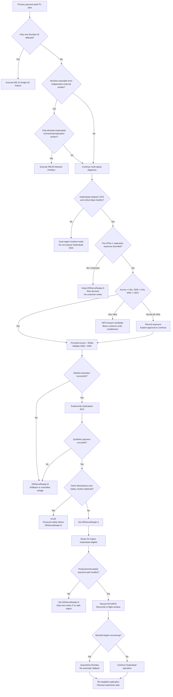

# RB-01 Decision Tree — Complete Primary Region Failure

Supports the full regional failover procedure. Branching is intentional so responders can evaluate the path without reading the full runbook first.

## Quantified branch rules

| Decision | Continue RB-01 when | Branch / stop when |
|----------|---------------------|--------------------|
| Failure domain | Multiple services/AZs in Mumbai fail | Single AZ only → RB-10 |
| Partition test | Mumbai unavailable to independent external observers | Mumbai still serves but cross-region link fails → RB-05 |
| DR health | Hyderabad EKS and stateful targets reachable | Hyderabad also unhealthy → dual-region incident |
| Tier-0/1 exposure | Bounded and within approved limits | Unknown or >60s → explicit risk decision |
| Aurora | Secondary valid and promotion succeeds | Promotion/integrity failure → no DNS exposure |
| Idempotency | Duplicate synthetic replay produces no second transaction | Duplicate financial action → stop immediately |
| DNS gate | `DRServeReady=1` after all technical gates | Endpoint reachability alone is insufficient |
| Failback | Reconciliation and planned switchover approved | Never auto-return traffic on Mumbai recovery |
