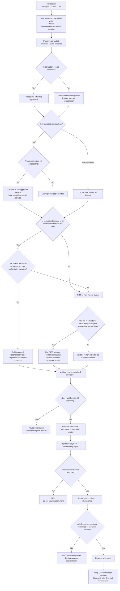

# RB-02 Decision Tree — Database Corruption

## Primary branch criteria

| Decision | Manual repair path | PITR / reference path |
|----------|--------------------|----------------------|
| Scope | Small, enumerable set | Unknown or broad table/relationship corruption |
| Fields | Specific columns/status values | Amounts, references, schema relationships uncertain |
| Correct truth | Reconstructable from bank/network/audit evidence | Not deterministically reconstructable row-by-row |
| Post-corruption legitimate writes | Must be preserved | Full cutover requires forward reconciliation/replay |
| Replica state | May also be corrupt | Clean replica useful only if verified and safely isolated |
