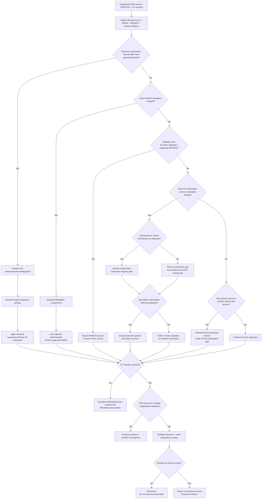

# RB-03 Decision Tree — DNS Poisoning / DNS Infrastructure Failure

## Branch rules

| Decision | Evidence |
|----------|----------|
| Hosted-zone compromise | Route 53 records or CloudTrail change events differ from approved IaC baseline |
| Registrar compromise | Parent `NS`/`DS` differs while hosted zone itself remains correct |
| DNSSEC failure | KSK/signing state degraded; validating resolvers fail |
| Provider outage | Broad authoritative failures while regional app endpoints remain healthy |
| Resolver poisoning | Authoritative data clean; only a subset of recursive resolvers return bad/stale answers |
| Static partner bypass | Valid only if Global Accelerator/static IPs were pre-provisioned and partner-tested |
| Final recovery | DNS + delegation + DNSSEC + TLS identity + payment/idempotency test all agree |
