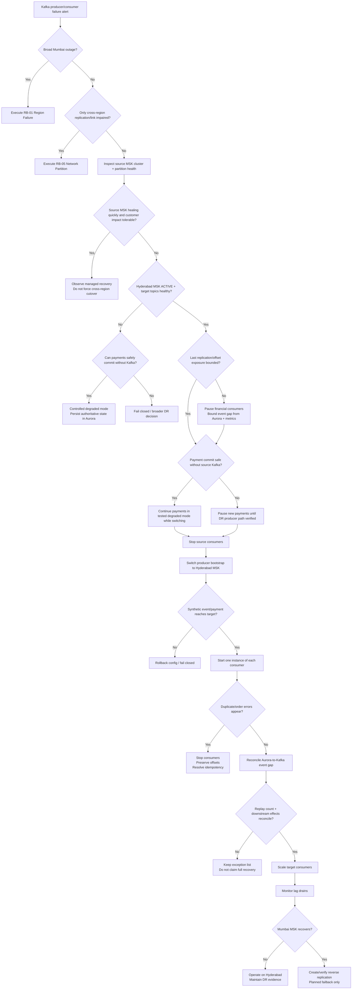

# RB-04 Decision Tree — Kafka / Amazon MSK Cluster Failure

## Quantified branch criteria

| Decision | Safe continuation | Stop / alternate branch |
|----------|-------------------|-------------------------|
| Failure scope | EKS/Aurora/ALB healthy; MSK-specific | Broad Region failure → RB-01 |
| Replication-only fault | Source MSK serves locally | Cross-region link only → RB-05 |
| Target cluster | Hyderabad `ACTIVE`, critical topics healthy | Target unhealthy → degraded/fail-closed |
| Replication exposure | Critical lag ≤30 s or bounded exception | Unknown exposure → pause financial consumers |
| Payment degraded mode | Authoritative Aurora commit independent of Kafka | Kafka required for safe commit → fail closed |
| Consumer recovery | No uncontrolled duplicate downstream action | Duplicate settlement → stop consumers |
| Failback | Reverse replication caught up; planned switch | Never auto-return to recovered source |
