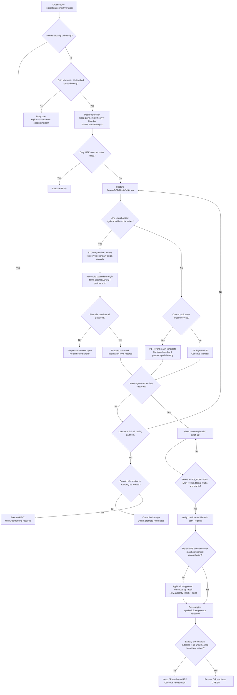

# RB-05 Decision Tree — Network Partition / Split-Brain Prevention

## Authority rule

A network partition **never automatically transfers authority**. Mumbai remains the only payment writer while both Regions are locally healthy. Hyderabad becomes writer only through an explicit RB-01 authority-transfer sequence after old-primary fencing.

## Quantified branch criteria

| Decision | Normal / continue | Escalate / stop |
|----------|-------------------|-----------------|
| Regional health | Both Regions locally reachable | Mumbai unavailable → RB-01 |
| DR readiness | Lag within targets | Critical exposure >60s → RPO breach candidate |
| Hyderabad writes | None expected in active-passive | Any production payment/idempotency write → split-brain P1 |
| Catch-up | Aurora ≤30s, DDB ≤15s, MSK ≤30s, Redis ≤60s | Keep DR red while above thresholds |
| Compound failure | Mumbai healthy → keep authority | Mumbai fails during partition → fail over only after fencing |
| Financial conflict | Reconciled against Aurora + external reference | Never accept last-writer-wins timestamp as financial truth alone |
