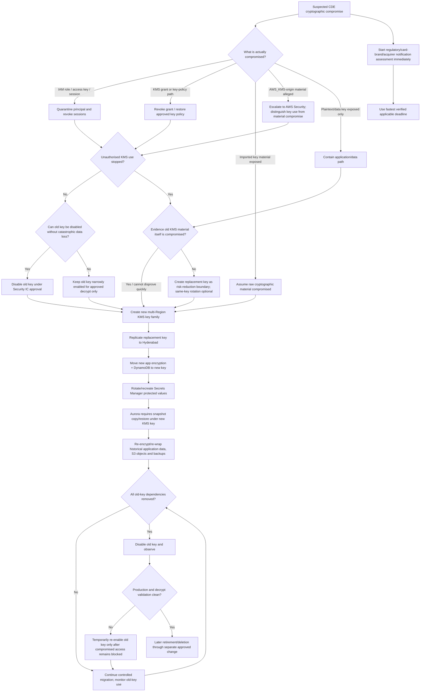

# RB-06 Decision Tree — Cryptographic Key Compromise

## Branch rules

1. **Identity/grant compromise is not automatically raw key-material compromise.** AWS KMS-origin key material cannot be exported through normal KMS APIs; distinguish unauthorised key *use* from actual cryptographic-material exposure.
2. **Imported material exposure is materially different.** If an external copy of imported material is exposed, the safe recovery boundary is a newly created key/material, followed by re-encryption.
3. **Disabling is reversible; deletion is not.** Initial containment must not schedule KMS deletion.
4. **Same-key rotation is not a complete response to compromised historical material.** Previous key material remains available to decrypt historical ciphertext. A new key family plus re-encryption is required for true trust-boundary replacement.
5. **Aurora encryption cannot simply be repointed to a new KMS key.** The migration path uses a snapshot copied under the replacement key and restoration to a replacement cluster.
6. **Changing an alias does not automatically re-encrypt dependent AWS resources.** Service-level migration must be verified explicitly.
7. **External reporting starts immediately.** Use the fastest verified applicable regulatory/payment-brand/acquirer timeline rather than waiting for an assumed fixed deadline.
