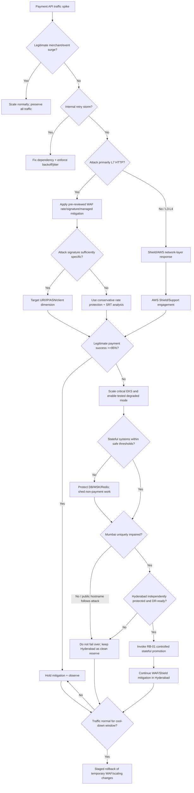

# RB-07 Decision Tree — DDoS Attack on Payment API

## Branch rules

1. A high request rate is not automatically an attack — distinguish festival/merchant demand from malicious traffic.
2. Internal retry storms are fixed at the dependency/client-retry layer, not treated as pure external DDoS.
3. Apply the narrowest WAF control that preserves legitimate payment traffic.
4. Shield-managed mitigation rule groups are not edited/deleted manually.
5. **Regional failover is not a default DDoS response.** Attackers targeting the public hostname may simply follow DNS to Hyderabad.
6. Hyderabad can be promoted only through RB-01 authority/replication/`DRServeReady` gates and must have equivalent WAF/Shield protection.
7. Idempotency and merchant retry backoff remain mandatory throughout the event.
