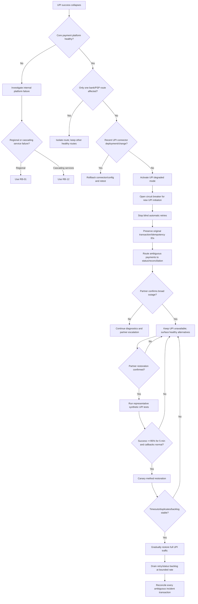

# RB-08 Decision Tree — Third-Party NPCI / UPI Outage

## Branch rules

1. A nationwide external-network outage is not fixed by moving AWS Regions; the standby Region depends on the same external payment network.
2. A connector or egress failure can mimic external-network failure and must be ruled out before external attribution.
3. Ambiguous timed-out transactions are not blindly replayed with new identifiers.
4. Original transaction IDs, external references and idempotency keys persist through status checks and any contractually permitted retry.
5. New UPI initiation can be disabled while status/reconciliation workflows remain available.
6. Restoration requires partner confirmation plus synthetic evidence; one successful request is not enough.
7. Backlog drain is rate-limited to avoid causing a second outage when the external network recovers.
8. Settlement remains gated for unresolved ambiguous transactions.
