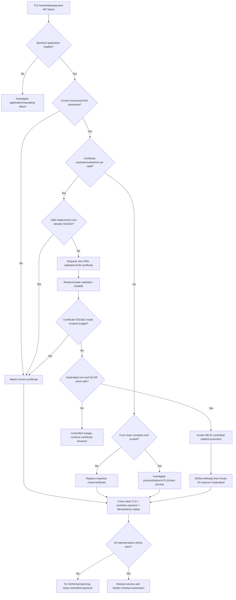

# RB-09 Decision Tree — Certificate Expiry / TLS Failure

## Branch rules

1. Prove the backend is healthy before treating every 443 failure as certificate-only.
2. An ACM certificate being `ISSUED` is insufficient if the ALB listener presents another certificate.
3. An already expired ACM certificate is not assumed recoverable through managed renewal; request/attach a valid replacement.
4. Mumbai and Hyderabad ACM certificates are regional and checked independently.
5. Never instruct merchants to disable certificate or hostname validation.
6. Regional DR still requires normal write-authority and `DRServeReady` gates.
7. Restoration requires cross-client trust testing plus a synthetic payment and duplicate-idempotency replay.
