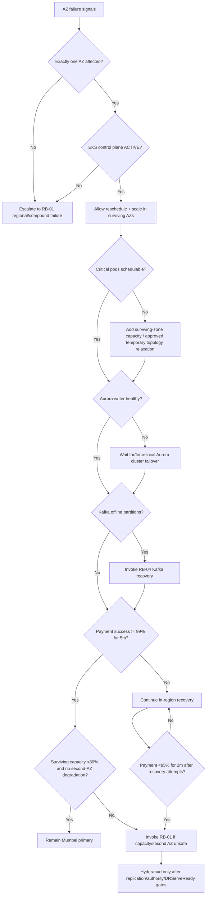

# RB-10 Decision Tree — Single-AZ Power Failure

## Branch rules

1. A single-AZ failure is contained in Mumbai whenever two healthy AZs can safely sustain payment traffic.
2. EKS control-plane availability does not prove worker/pod capacity; both are checked.
3. Aurora normally handles local writer failure automatically; manual failover is a fallback, not the first action.
4. Offline MSK brokers alone do not imply Kafka outage — offline partitions, client failover and replication health decide whether RB-04 is needed.
5. Cross-Region DR is triggered by measured service/capacity failure or compound AZ degradation, not the mere existence of one unavailable AZ.
6. A recovered AZ is reintroduced by controlled canary, never by immediately repacking all workloads into it.
