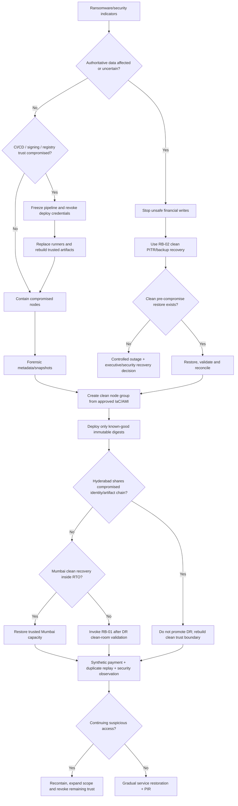

# RB-11 Decision Tree — Ransomware Attack on Infrastructure

## Branch rules

1. Compromised nodes are rebuilt, not cleaned and reused.
2. CI/CD compromise invalidates trust in artifacts built after the earliest compromise point until independently verified/rebuilt.
3. Backups are restored only from points whose integrity and date relative to compromise are established.
4. Hyderabad is not assumed clean merely because it is a different Region; shared credentials/artifacts can compromise both Regions.
5. Evidence preservation happens before destructive termination when operationally safe.
6. Security containment controls are never rolled back simply to improve availability.
7. Ransomware data recovery uses immutable/cross-account recovery sources and RB-02 reconciliation where authoritative records are affected.
