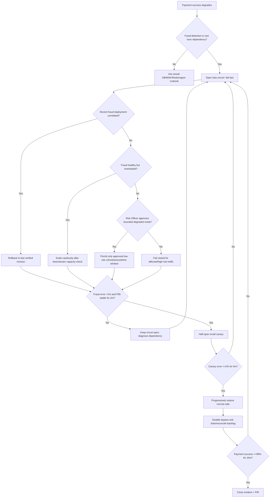

# RB-12 Decision Tree — Cascading Microservice Failure

## Branch rules

1. Circuit breaking prevents slow/failing fraud calls from consuming transaction-processor resources indefinitely.
2. The temporary fraud bypass is not global “fraud off”; it is a Risk-approved low-risk cohort/amount/time envelope with full audit tagging.
3. High-risk traffic can remain fail-closed while low-risk traffic uses degraded mode.
4. Scaling a failing service is allowed only after checking whether the true bottleneck is downstream; otherwise scaling can amplify the cascade.
5. A known-bad application revision is rolled back before considering regional DR.
6. Hyderabad is not promoted for an application defect deployed identically there.
7. Recovery uses a half-open canary before fully closing the circuit and requires payment success ≥99% for a sustained validation window.
